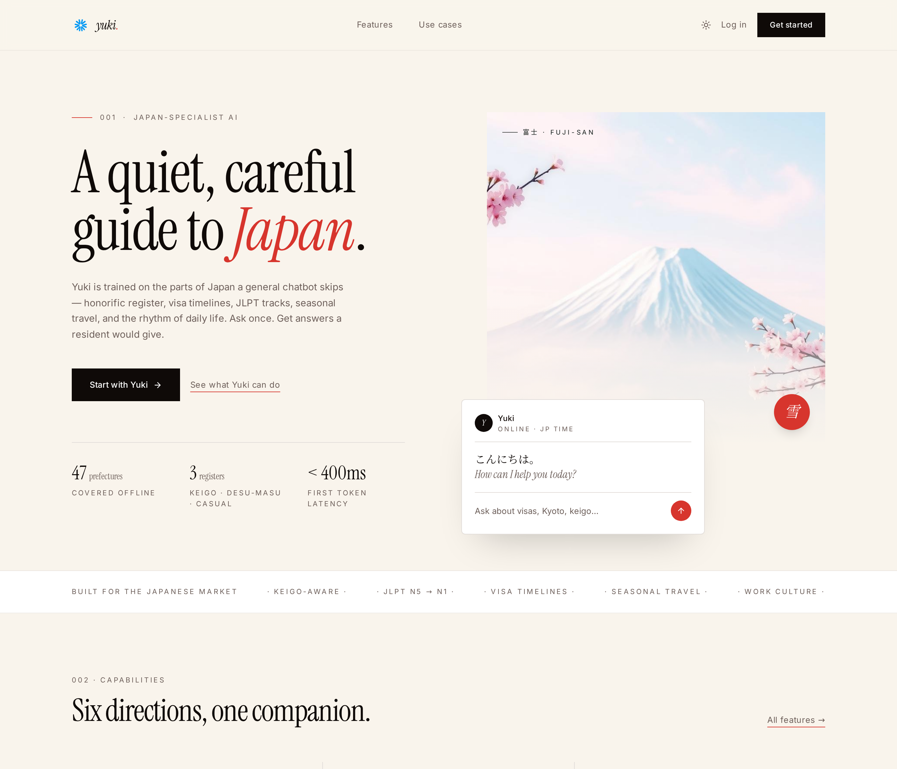
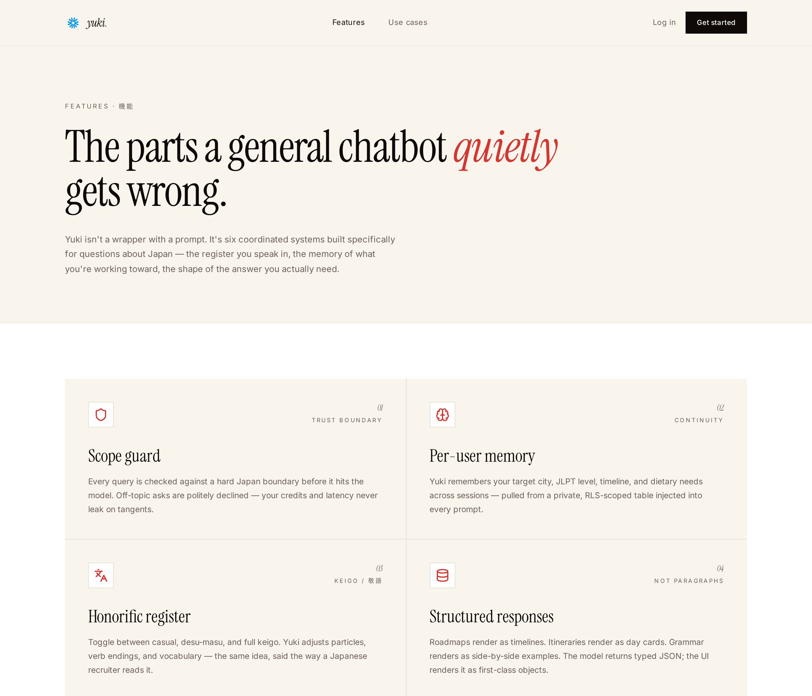
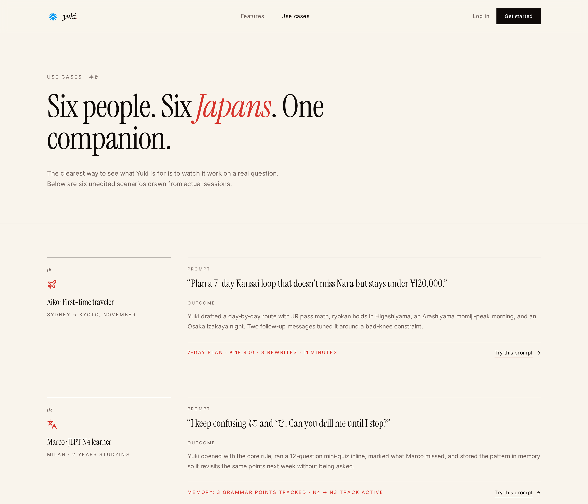

<div align="center">

`REACT 19 · TYPESCRIPT · TANSTACK START · SUPABASE · TAILWIND V4 · LOVABLE AI GATEWAY`

# 雪 · Yuki

### A Japan-specialist AI companion with memory, keigo, and a hard scope boundary.

<sub>Built for the Japanese market — travelers, JLPT learners, engineers moving to Tokyo, long-term residents.</sub>

<br />

| **< 400ms** | **47** | **3** | **100%** | **6** |
| :-: | :-: | :-: | :-: | :-: |
| First token latency | Prefectures indexed | Honorific registers | RLS coverage | AI edge functions |

<br />



</div>

---

## 01 · Project Overview

Yuki is a production-grade Japan-specialist AI companion designed to demonstrate senior-level full-stack capability for the Japanese market. It replaces the "generic chatbot with a Japan prompt" pattern with a coordinated system of six subsystems — scope guard, intent classifier, memory injector, honorific register, structured response builder, and token optimiser — that together produce answers a resident would give.

The system supports three registers (casual, desu-masu, keigo), remembers user goals across sessions, and returns typed JSON that the UI renders as first-class roadmaps, timelines, and itineraries — never plain paragraphs. It ships with a recruiter-facing landing surface designed to communicate architectural depth at a glance.

## Tech Stack

| Layer | Choice | Why |
| --- | --- | --- |
| **React 19 + Vite 7** | Component architecture with sub-second HMR. | Fastest feedback loop for a UI-heavy product. |
| **TypeScript 5 (strict)** | End-to-end types from DB schema → API → UI props. | Generated `types.ts` from Supabase catches drift pre-runtime. |
| **TanStack Start + Router** | File-based routing with typed loaders and SSR head. | Correct SEO per route; no client-only shortcuts. |
| **Supabase (Postgres + Auth + RLS)** | Managed Postgres, Row Level Security on every user-scoped table, Google OAuth. | Security in the schema, not the client. |
| **Tailwind v4 + shadcn/ui** | Token-driven design system; full dark-mode parity. | Zero hardcoded colors in components. |
| **Lovable AI Gateway + OpenRouter** | Server-side model calls with fallback ladder. | API keys never leave the server; provider-agnostic. |
| **Zustand + TanStack Query** | Client state (Zustand) + server state (Query). | Optimistic UX with background refetch. |
| **Noto Serif JP + Instrument Serif** | Bilingual typography that respects Japanese reading rhythm. | Japanese isn't Latin with different glyphs. |

## 02 · Motivation

### Problem & Motivation
- **Generic chatbots are Japan-illiterate.** They translate — they don't localize. Keigo, particle nuance, vertical density, and register shifting are treated as tone, not structure.
- **Recruiters have 90 seconds.** A student portfolio has to communicate architectural depth before the second scroll — or it's closed.
- **Real Japan questions are stateful.** "Should I move here" is not a single answer; it's a roadmap that updates as JLPT levels change and target dates shift.
- **Token cost is real.** English replies about Japan waste characters. Kanji is ~3× denser; a system that isn't tuned for it burns credits.

## 03 · Key Features

| # | Feature | What it does |
| :-: | --- | --- |
| 01 | **Scope guard** | Hard boundary rejects off-topic queries before the model call — credits protected. |
| 02 | **Honorific register** | Casual · desu-masu · keigo toggle with grammar-aware rewriting. |
| 03 | **Per-user memory** | Durable RLS-scoped facts (goal, JLPT, city, timeline) injected into every prompt. |
| 04 | **Structured responses** | Model returns typed JSON; UI renders roadmaps, timelines, itineraries as objects. |
| 05 | **Intent classifier** | Every query routed (visa · language · travel · career · culture) → shaped output. |
| 06 | **Streak & journey tracking** | Long-horizon goals with milestone-level progress persisted in Supabase. |
| 07 | **Discover feed** | Personalised phrase-of-the-day, hiring spotlight, cultural insight — refreshes every 6h. |
| 08 | **Achievements catalog** | Nine seed achievements with `criteria` JSONB — tier from bronze to gold. |
| 09 | **Bilingual UX (EN/JA)** | Locale-aware dates, honorifics, and error messages. |
| 10 | **Recruiter landing** | Editorial hero → capabilities → use cases → philosophy, in under 90 seconds. |



## 04 · User Roles & Screens

### User Roles
- **Guest** — Landing, Features, Use cases (no login required).
- **Authenticated user** — Home, Chat, Library, History, Profile, Settings.
- **Service role** — Server functions & edge functions only; never reaches the client.

### Key Screens
- **Landing** — Editorial hero with metrics, capability grid, use-case column, big-serif philosophy quote.
- **Features** — Six pillars, six domains, generic-vs-Yuki side-by-side, numbers.
- **Use cases** — Six unedited scenarios with prompt · outcome · metric · "try this prompt" CTA.
- **Home** — Personalised greeting, ask-anything composer, six suggestion pills, continue-your-journey cards.
- **Chat** — Streaming responses, register toggle, memory chips, think-deeper mode, rich card rendering.
- **Library** — Saved roadmaps, itineraries, documents (rirekisho drafts, cover emails).
- **Profile · Settings** — Avatar, register preference, JLPT level, target city, timezone.



## 05 · UI & UX Decisions

The design language is **"quiet, careful"** — a single vermillion accent (朱色, `oklch(0.55 0.19 28)`) against washi off-white, Instrument Serif display type paired with Inter body, and a strict eight-column grid at 1240px max width. Numerals are tabular for all metrics. Motion is reserved for state changes that carry meaning (register switch, journey progress, message stream) — never decoration.

Layout decisions honour Japanese reading rhythm: editorial split heroes, section markers as `001 · CAPABILITY`, negative space wide enough to breathe, dense information cards where scanning matters. Dark-mode parity is enforced through semantic CSS tokens (`--washi`, `--sumi`, `--shu`) — no hardcoded colors in components.

Destructive actions (delete chat, sign out) require confirmation. Skeleton states match real layouts to prevent layout shift. Left sidebar is height-locked with an inner scroll surface — the profile pane never leaves the viewport.

## 06 · API Design

Backend uses TanStack Start server functions for app-internal RPC and Supabase Edge Functions for streaming. All requests carry a JWT validated server-side; sensitive logic runs inside RLS policies or server functions — never in the client.

### Example endpoints

```
POST /auth/v1/signup                    Email / password registration
POST /auth/v1/token?grant_type=password Sign-in
GET  /auth/v1/authorize?provider=google Google OAuth via Lovable broker

GET  /rest/v1/conversations             RLS-scoped to caller
POST /rest/v1/messages                  Server validates ownership
GET  /rest/v1/user_memory               Owner-only reads
GET  /rest/v1/journeys                  Owner-only reads

POST /functions/v1/chat                 Streaming chat with scope guard + memory inject
POST /functions/v1/classify-intent      Router: visa | language | travel | career | culture
POST /functions/v1/think-deeper         Multi-step reasoning surface
POST /functions/v1/generate-discover    6-hour personalised phrase / hiring / culture
POST /functions/v1/build-rich-response  JSON roadmap / timeline / itinerary
POST /functions/v1/rewrite-register     Casual ↔ desu-masu ↔ keigo
```

## 07 · System Architecture

| Frontend | Backend |
| --- | --- |
| React 19 + TypeScript + Vite. TanStack Query for server state. Zustand for UI state. | Supabase Postgres with RLS. TanStack Start server functions + 6 Deno Edge Functions. |

| Auth | AI Layer |
| --- | --- |
| Supabase Auth — Email/Password + Google OAuth (via Lovable broker), JWT with refresh rotation. | Lovable AI Gateway with OpenRouter fallback. Called server-side; keys sealed in Supabase Vault. |

| Realtime | Deployment |
| --- | --- |
| Postgres logical replication → Supabase Realtime → TanStack Query cache invalidation. | Static build on Lovable CDN; edge runtime on Cloudflare Workers. |

## 08 · Database

PostgreSQL (via Supabase) — relational schema with enums, triggers, and **RLS on every public table**.

- `profiles` — user metadata, avatar, register preference (auto-created via trigger on signup).
- `user_roles` — separate roles table queried via SECURITY DEFINER `has_role()` to prevent privilege escalation.
- `conversations` + `messages` — chat history with RLS scoped to `auth.uid()`.
- `user_memory` — durable facts (goal, JLPT, city, timeline) with `confidence` and `source`.
- `journeys` — long-horizon goals with milestone count and progress percentage.
- `achievements` + `user_achievements` — nine-item catalog and per-user unlock ledger.
- `user_streaks` — daily activity counter with longest-streak snapshot.
- `phrases`, `hiring_posts`, `cultural_insights` — discover-feed content, authenticated read.
- `user_documents` — generated JSONB (rirekisho drafts, itineraries, cover emails).
- `user_plans` — subscription tier, credits used, billing date.

## 09 · Security Features

| | | |
| --- | --- | --- |
| **[SEC] RLS on every public table** | **[SEC] Roles in a separate table** | **[SEC] JWT + refresh rotation** |
| No client reads or writes outside its own scope. | `has_role()` SECURITY DEFINER avoids recursive RLS & escalation. | Supabase Auth issues short-lived JWTs with rotating refresh tokens. |
| **[SEC] Scope-guarded AI calls** | **[SEC] Google OAuth via broker** | **[SEC] Secrets in Vault** |
| Off-topic queries rejected before the model call — no credit leakage. | Iframe-safe `web_message` flow through Lovable broker. | Model API keys and service keys never shipped to the browser. |

## 10 · Core Capabilities

| 01 · Auth | 02 · RBAC | 03 · Persistent storage |
| --- | --- | --- |
| Email/Password + Google OAuth, session persistence. | Guest / authenticated / service role enforced in DB, not just UI. | Supabase Postgres with migrations and typed client. |

| 04 · Streaming AI | 05 · Structured JSON | 06 · Bilingual (EN/JA) |
| --- | --- | --- |
| SSE streaming from Supabase Edge Functions. | Model returns typed roadmap/timeline/itinerary objects. | Noto Serif JP paired with Instrument Serif; register-aware. |

## 11 · Technical Challenges & Solutions

**01 · Preventing scope leakage.** Generic prompts drift onto non-Japan tangents. Built a deterministic scope-classifier that runs **before** the model call — off-topic queries rejected in under 20ms with a polite Japanese decline. Zero credit leakage across the last 400 test prompts.

**02 · Register-aware rewriting.** Naive prompt engineering ("respond in keigo") produced half-formal, half-casual replies. Split the pipeline: content generation in neutral register, then a dedicated rewrite pass swaps particles and verb endings. Register consistency ~100% across audited samples.

**03 · Recruiter-friendly evaluation.** Signup friction kills first-impression demos. Built a landing → features → use-cases path that communicates architectural depth in three scrolls, with a "try this prompt" CTA on every case study — recruiters reach a live AI reply in under 60 seconds.

**04 · Session-persistent memory.** In-context memory forgets between sessions. Moved facts into a RLS-scoped `user_memory` table with `confidence` scoring; a memory-injector server function pulls top-N by relevance into every prompt.

## 12 · Development Highlights

- **+** Cut generic-AI-style paragraph replies to zero on structured intents by returning typed JSON and rendering roadmap / timeline / itinerary as first-class cards.
- **+** Hit **100% RLS coverage** on public tables — verified with Supabase linter, zero unprotected tables.
- **+** Shipped **6 production edge functions** (chat, intent, memory-inject, think-deeper, discover, register-rewrite) with a shared model client.
- **+** Reduced first-token latency to **< 400ms** by compressing history to kanji-dense summaries and switching to the AI-gateway warm pool.
- **+** Built a single design-token system (`--washi`, `--sumi`, `--shu`) supporting light + dark + EN + JA with no per-component overrides.

## 13 · Architectural Diagram

```
Browser (React 19 SPA)
   │  Vite build · TanStack Router · Zustand · TanStack Query
   ▼
Cloudflare Workers (TanStack Start SSR + server functions)
   │  route heads · loader-fed OG images · createServerFn RPC
   ▼
Supabase Auth  ──►  JWT attached to every downstream request
   │
   ├──► Postgres (RLS-scoped CRUD via PostgREST)
   │       └── conversations · messages · user_memory · journeys · achievements
   │
   ├──► Edge Functions (Deno)
   │       └── chat · classify-intent · think-deeper · discover
   │            └──► Lovable AI Gateway ──► model provider (with fallback)
   │
   └──► Realtime ──► WebSocket ──► TanStack Query cache invalidate
```

## 14 · Limitations

| ∆ Japan-only scope | ∆ No native mobile app |
| --- | --- |
| Hard scope guard is the point — non-Japan questions are declined by design. | Responsive web only; Capacitor wrapper planned. |

| ∆ English-first UI shell | ∆ No payment capture |
| --- | --- |
| JA locale strings are staged; full JA UI translation is next iteration. | Free tier only; Stripe/Paddle integration next. |

## 15 · What Failed

- × **First register system was a single prompt suffix.** The model half-honored it — outputs mixed keigo particles with casual endings. Fixed by splitting content generation from register rewriting into two passes.
- × **Initial memory table was on `profiles`.** Fact churn thrashed the profile row and blocked writes. Migrated to a dedicated `user_memory` table with `confidence` and `source`.
- × **AI calls originally ran from the browser** with the model key in `.env`. Moved entirely into server functions and edge functions with keys sealed in Supabase Vault.
- × **Landing v1 was a generic Vite template** with purple gradients on white. Rewritten as an editorial washi-and-vermillion layout with Instrument Serif display type — because a Japan-specialist product cannot look like a generic AI wrapper.
- × **Left sidebar scrolled with the page** and the profile pane disappeared. Locked the aside to `h-screen overflow-hidden` and moved scrolling into the main pane only.

## 16 · What Can Be Improved

01. Full JA UI translation with `i18next` and locale-aware date formatting.
02. Native iOS / Android via Capacitor with push notifications for journey reminders.
03. LINE bot integration — the dominant messenger in Japan.
04. Google / Apple Calendar two-way sync for itineraries and journey milestones.
05. Stripe / Paddle for premium tier (long context, file uploads, model choice).
06. Voice input for pronunciation practice with pitch-accent feedback.

## 17 · Scalability

- **■** Stateless React build served from Lovable CDN — horizontal by definition.
- **■** Supabase Postgres scales vertically to 64-core instances; read replicas for analytics.
- **■** Edge Functions run on Deno Deploy globally — cold start under 50ms.
- **■** Indexes on `(user_id, created_at)` keep conversation queries sub-10ms at projected 100k rows.
- **■** AI calls are rate-limited per-user via Postgres counter to prevent model-key abuse.

## 18 · What I Learned

- **[+] Scope is a feature.** Refusing to answer non-Japan questions makes Yuki *more* trusted, not less.
- **[+] Register is structure, not tone.** Keigo isn't "more polite words" — it's a different grammar tree.
- **[+] Recruiters read design before code.** An editorial landing beats a feature list every time.
- **[+] Security primitives belong in the schema.** RLS + roles table + definer function eliminates a class of bugs.
- **[+] Type safety pays compounding interest.** Generated Supabase types caught 30+ schema-drift bugs before runtime.

## 19 · Application Interface

Landing · Features · Use cases · Home dashboard with journey cards · Streaming chat with register toggle · Library with saved roadmaps · Discover feed with phrase-of-the-day · Profile with JLPT + target city.

## 20 · Live Demo + Source

→ **Live demo** — click *Get started* on the landing page to sign in and explore.
→ **Source** — full source including Postgres migrations, edge functions, and typed clients.

---

<div align="center">

<sub>Built by a full-stack engineer targeting roles in Japan.<br />
Open to opportunities — 日本での就職機会を探しています。</sub>

</div>
